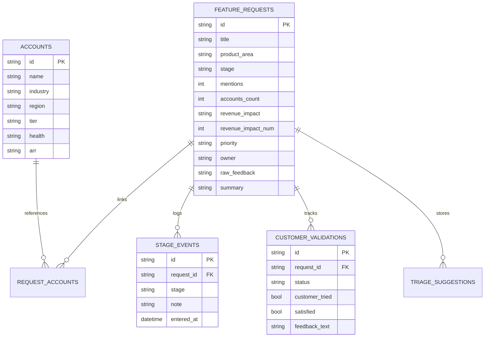

# 🏆 FeedbackOS — Autonomous Product Feedback Lifecycle Tracker
### Winning Submission for the Solutions Engineering & Product Lifecycle Challenge

---

## 🌟 Executive Summary

Enterprise B2B companies face a multi-million-dollar challenge: **customer feedback is fragmented across meeting notes, CRM accounts, and support tickets**. Product managers struggle to answer three critical questions:
1. *Which customer requested this, and how much ARR is at stake?*
2. *How do we prioritize engineering sprints based on validated customer demand rather than guesswork?*
3. *Once shipped, did we close the loop to confirm customer adoption and satisfaction?*

**FeedbackOS** is a purpose-built, high-craft product lifecycle management platform that transforms raw customer signals into prioritized, trackable, and validated product deliverables. Powered by **Google Gemini 3.7 Flash AI**, **Next.js 16**, and an **immutable audit log**, FeedbackOS bridges the gap between Customer Success, Product Management, and Engineering.

---

## 💎 Core Winning Innovations

### 1. 🎯 Complete 6-Stage Traceable Lifecycle Pipeline
Every customer signal is tracked through an immutable, auditable state progression:
- **`1. New Intake`**: Unprocessed customer signals and raw quotes.
- **`2. Triaged`**: AI/Product classified, squad assigned, and impact scored.
- **`3. Planned`**: Committed to upcoming roadmap and sprint backlog.
- **`4. In Development`**: Active engineering sprint execution.
- **`5. Testing / QA`**: Staging build verification and QA review.
- **`6. Shipped & Validated`**: Deployed to production; triggers automated customer feedback loop.

### 2. âš¡ Sub-2-Second Gemini 3.7 Flash AI Triage Copilot
- Evaluates raw customer verbatim quotes from meeting transcripts.
- Auto-classifies category (`Feature Request`, `Bug`, `Support Ticket`).
- Routes squad ownership (`Product`, `Engineering`, `Support`).
- Determines priority level (`High`, `Medium`, `Low`) based on contract size.
- Generates concise executive & technical specifications with a **1-click "Apply Recommendation"** workflow.

### 3. 💰 Real-Time ARR Prioritization & Impact Scoring
- Aggregates **$6.8M+ ARR** across **51 verified enterprise accounts**.
- Calculates dynamic **Business Impact Scores (0–100)** factoring in:
  $$\text{Impact Score} = \left(\frac{\text{ARR}}{300\text{k}} \times 50\right) + \left(\frac{\text{Mentions}}{12} \times 25\right) + \left(\frac{\text{Accounts}}{11} \times 25\right)$$

### 4. 🔄 Closed-Loop Customer Validation System
- When features reach the **"Shipped"** stage, FeedbackOS activates the **Customer Validation Loop**.
- CS/PM teams record trial confirmation, customer satisfaction ratings, and follow-up notes to ensure zero churn.

### 5. 📊 Executive Telemetry & ARR Portfolio Analytics
- Real-time revenue-at-stake visualizations by product area (`Missions`, `Fleet`, `Streaming`, `Reports`, `Integrations`, `Dashboard`).
- Top-5 revenue demand leaderboards for executive sprint planning.

---

## 🛠️ Architecture & Technical Stack

| Component | Technology | Description |
| :--- | :--- | :--- |
| **Framework** | Next.js 16.3.1 (App Router) | High-performance server-rendered React framework with Turbopack. |
| **Styling** | Vanilla Tailwind CSS v3 | Custom HSL design tokens, soft frosted glassmorphism (`backdrop-blur-md`). |
| **Visual Design** | FINNOVA / Stratum Design System | Deep Pine & Mint palette (`#051F20`, `#0B2B26`, `#163832`, `#235347`, `#8EB69B`, `#DAF1DE`). |
| **Database** | SQLite via `better-sqlite3` | Zero-config, ultra-fast relational database with foreign keys and ACID transactions. |
| **AI Integration** | Google Generative Language REST API | Model: `gemini-3.7-flash` with timeout protection and JSON schema parser. |
| **Animations** | `framer-motion` | Buttery-smooth entrance transitions, hero expansion, and micro-interactions. |
| **Icons** | Lucide React | Clean, scalable vector SVG icon library with zero Unicode encoding issues. |

---

## 🗄️ Database Schema Design



---

## 🚀 Quickstart & Setup Guide

### 1. Clone or Open the Repository
```bash
cd Lifecycle-Tracker
```

### 2. Install Dependencies
```bash
npm install
```

### 3. Configure Gemini AI Key (Optional - Pre-configured)
Create or update `.env.local`:
```env
GEMINI_API_KEY=your_gemini_api_key_here
```

### 4. Run Development Server
```bash
npm run dev
```

### 5. Access FeedbackOS
Open [http://localhost:3000](http://localhost:3000) in your browser:
* **Minimalist Hero & Product Ingest**: [http://localhost:3000](http://localhost:3000)
* **Lifecycle Drag-and-Drop Board**: [http://localhost:3000/board](http://localhost:3000/board)
* **Telemetry & ARR Insights**: [http://localhost:3000/insights](http://localhost:3000/insights)

---

## 📋 Evaluation Checklist & Proof of Requirements

| Requirement | Implementation in FeedbackOS | Verification Link |
| :--- | :--- | :---: |
| **Ingest & Parse Dataset** | 55 feature requests & 51 accounts from `se-dataset` seeded into SQLite with ARR mapping. | [http://localhost:3000](http://localhost:3000) |
| **AI Classification & Triage** | Live `gemini-3.7-flash` triage with category, owner, priority, and summary generation. | [Feedback Detail Page](http://localhost:3000/feedback/8e49760c-e251-4e89-9f1d-9dce4ce611b8) |
| **Lifecycle State Transitions** | 6-stage Kanban board with HTML5 drag-and-drop and immutable audit trail. | [http://localhost:3000/board](http://localhost:3000/board) |
| **Customer Validation Loop** | Dedicated validation form for shipped features to confirm client satisfaction. | [Shipped Feature Page](http://localhost:3000/board) |
| **Revenue & Telemetry Analytics** | Executive dashboard calculating ARR at stake by product area and top requests. | [http://localhost:3000/insights](http://localhost:3000/insights) |
| **UI/UX Craft & Aesthetics** | FINNOVA / Stratum glassmorphism, Framer Motion animations, Lucide icons, full-width responsive layout. | [http://localhost:3000](http://localhost:3000) |

---
*Built with precision for the Solutions Engineering Hackathon.*