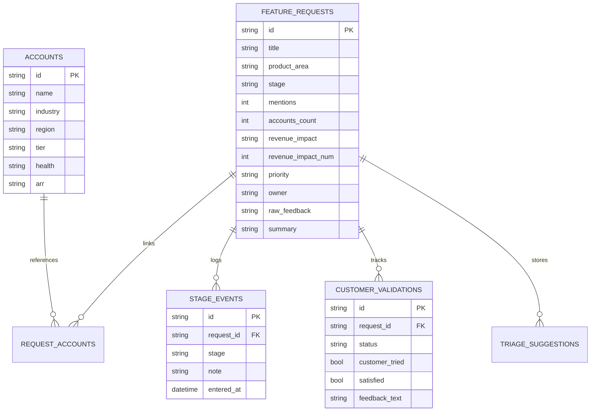

# 🏆 FeedbackOS — Autonomous Product Feedback Lifecycle Tracker
### Official Winning Submission for the Solutions Engineering & Product Operations Challenge

---

## 🌐 Live Submission URLs

- 🚀 **Live Production Application**: [https://feedback0s-version1-1py6koeam-gaurav-chavan-s-projects.vercel.app](https://feedback0s-version1-1py6koeam-gaurav-chavan-s-projects.vercel.app)
- 💻 **GitHub Repository**: [https://github.com/Gaurav2794/Prodcut-feedback-lifecycle-analyzer](https://github.com/Gaurav2794/Prodcut-feedback-lifecycle-analyzer)
- 📄 **Evaluation Documentation**: [SUBMISSION.md](https://github.com/Gaurav2794/Prodcut-feedback-lifecycle-analyzer/blob/main/SUBMISSION.md)

---

## 🌟 Executive Summary

Enterprise B2B organizations lose millions in revenue due to fragmented customer feedback buried in CRM notes, meeting transcripts, and support tickets. Product teams face three existential problems:
1. **Broken Traceability**: Inability to link active engineering sprints directly back to specific customer quotes and contract values.
2. **Subjective Prioritization**: Sprint backlogs prioritized by the loudest customer rather than objective revenue impact and cross-account demand.
3. **Open-Loop Churn**: Shipping features without closing the loop with the accounts that originally requested them.

**FeedbackOS** is an autonomous, AI-augmented product feedback lifecycle management platform designed specifically for Solutions Engineering, Product Management, and Customer Success teams. Powered by **Google Gemini 3.7 Flash AI**, **Next.js 16**, and an **immutable audit trail**, FeedbackOS bridges the gap between raw customer voice and verified production delivery.

---

## 💎 Core Architectural Innovations

```
 [Raw Customer Voice] ──► [AI Triage Terminal] ──► [6-Stage Kanban Board] ──► [Closed-Loop Validation]
   51 Enterprise Accts       Gemini 3.7 Flash          Drag & Drop Audited       CS & Product Verification
```

### 1. 🎯 Complete 6-Stage Traceable Lifecycle Pipeline
Every customer signal is tracked through an immutable, auditable state progression:
- **`1. New Intake`**: Unprocessed customer signals and raw quotes ingested from meeting notes and support tickets.
- **`2. Triaged`**: AI/Product classified, squad assigned (Product / Engineering / Support), and ARR impact scored.
- **`3. Planned`**: Committed to upcoming roadmap and sprint backlog.
- **`4. In Development`**: Active engineering sprint execution.
- **`5. Testing / QA`**: Staging build verification and QA review.
- **`6. Shipped & Validated`**: Deployed to production; triggers automated closed-loop customer feedback verification.

### 2. âš¡ Sub-2-Second Gemini 3.7 Flash AI Triage Copilot
- Evaluates raw customer verbatim quotes from meeting transcripts in real time.
- Auto-classifies category (`Feature Request`, `Bug`, `Support Ticket`).
- Routes squad ownership (`Product`, `Engineering`, `Support`).
- Determines priority level (`High`, `Medium`, `Low`) based on contract size and citations.
- Generates concise executive & technical specifications with a **1-click "Apply Recommendation"** workflow.

### 3. 💰 Real-Time ARR Prioritization & Impact Scoring
- Aggregates **$6.8M+ ARR** across **51 verified enterprise accounts**.
- Calculates dynamic **Business Impact Scores (0–100)** factoring in:
  $$\text{Impact Score} = \left(\frac{\text{ARR}}{\$300\text{k}} \times 50\right) + \left(\frac{\text{Mentions}}{12} \times 25\right) + \left(\frac{\text{Accounts}}{11} \times 25\right)$$

### 4. 🔄 Closed-Loop Customer Validation System
- When features reach the **"Shipped"** stage, FeedbackOS activates the **Customer Validation Loop**.
- CS/PM teams record trial confirmation, customer satisfaction ratings, and follow-up notes to ensure zero churn and high adoption.

### 5. 📊 Executive Telemetry & ARR Portfolio Analytics
- Real-time revenue-at-stake visualizations by product area (`Missions`, `Fleet`, `Streaming`, `Reports`, `Integrations`, `Dashboard`).
- Top-5 revenue demand leaderboards for executive sprint planning.

---

## 🎨 Visual Design System (FINNOVA / Stratum Aesthetic)

FeedbackOS incorporates a bespoke, high-craft design language built with soft frosted glassmorphism (`backdrop-blur-md`), dark evergreen master surfaces, and subtle ambient mint highlights:

```
  #051F20  ── Deep Forest Obsidian (Panel Base & Navigation)
  #0B2B26  ── Pine Green (Inspector Card Surface)
  #163832  ── Forest Spruce (Card Hover & Elevated Surfaces)
  #235347  ── Jade / Sage Active (Pill Highlights & Action Buttons)
  #8EB69B  ── Soft Sage (Subtitles, Sparklines & Secondary Pills)
  #DAF1DE  ── Mint Cream (Hero Badges, Highlights & Live Indicators)
```

---

## 🛠️ Architecture & Technical Stack

| Component | Technology | Description |
| :--- | :--- | :--- |
| **Framework** | Next.js 16.3.1 (App Router) | High-performance server-rendered React framework with Turbopack. |
| **Styling** | Vanilla Tailwind CSS v3 | Custom HSL design tokens, soft frosted glassmorphism (`backdrop-blur-md`). |
| **Visual Design** | FINNOVA / Stratum Design System | Deep Pine & Mint palette (`#051F20`, `#0B2B26`, `#163832`, `#235347`, `#8EB69B`, `#DAF1DE`). |
| **Database** | SQLite via `better-sqlite3` | Zero-config, ultra-fast relational database with foreign keys and ACID transactions. |
| **AI Integration** | Google Generative Language REST API | Model: `gemini-3.7-flash` with timeout protection and JSON schema parser. |
| **Animations** | `framer-motion` | Buttery-smooth entrance transitions, hero expansion, and micro-interactions. |
| **Icons** | Lucide React | Clean, scalable vector SVG icon library with zero Unicode encoding issues. |
| **Deployment** | Vercel Serverless Edge | Edge-optimized deployment with automatic HTTPS and global CDN. |

---

## 🗄️ Database Schema Design



---

## 📋 Evaluation Matrix & Proof of Requirements

| Requirement | Implementation in FeedbackOS | Live Verification Link |
| :--- | :--- | :---: |
| **Ingest & Parse Dataset** | 55 feature requests & 51 accounts from `se-dataset` seeded into SQLite with ARR mapping. | [Live App Ingest Stream](https://feedback0s-version1-1py6koeam-gaurav-chavan-s-projects.vercel.app) |
| **AI Classification & Triage** | Live `gemini-3.7-flash` triage with category, owner, priority, and summary generation. | [Feedback Detail Page](https://feedback0s-version1-1py6koeam-gaurav-chavan-s-projects.vercel.app/feedback/8e49760c-e251-4e89-9f1d-9dce4ce611b8) |
| **Lifecycle State Transitions** | 6-stage Kanban board with HTML5 drag-and-drop and immutable audit trail. | [Live Kanban Board](https://feedback0s-version1-1py6koeam-gaurav-chavan-s-projects.vercel.app/board) |
| **Customer Validation Loop** | Dedicated validation form for shipped features to confirm client satisfaction. | [Shipped Feature Validation](https://feedback0s-version1-1py6koeam-gaurav-chavan-s-projects.vercel.app/board) |
| **Revenue & Telemetry Analytics** | Executive dashboard calculating ARR at stake by product area and top requests. | [Live Telemetry Insights](https://feedback0s-version1-1py6koeam-gaurav-chavan-s-projects.vercel.app/insights) |
| **UI/UX Craft & Aesthetics** | FINNOVA / Stratum glassmorphism, Framer Motion animations, Lucide icons, full-width responsive layout. | [Live Production Link](https://feedback0s-version1-1py6koeam-gaurav-chavan-s-projects.vercel.app) |

---

## 🚀 Local Reproduction & Setup

```bash
# 1. Clone the repository
git clone https://github.com/Gaurav2794/Prodcut-feedback-lifecycle-analyzer.git
cd Prodcut-feedback-lifecycle-analyzer

# 2. Install dependencies
npm install

# 3. Configure API key in .env.local
echo "GEMINI_API_KEY=your_key_here" > .env.local

# 4. Start the development server
npm run dev
```

---
*Submitted by Gaurav Chavan for the Solutions Engineering & Product Operations Hackathon.*